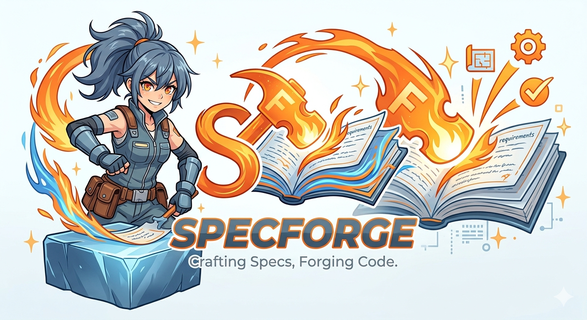

<p align="center">
  
</p>

# SpecForge

Spec-Driven Development framework. The specification is the product — code is a regenerable byproduct.

A 4-skill feature pipeline + `sf-audit` for project-wide review + support skills. Progressive disclosure. Human gate on every artefact. No ceremony without purpose.

**New here?** Read [the mental model](docs/mental-model.md) first — one page on how SpecForge thinks.

**Install:** see [INSTALL.md](INSTALL.md). **License:** [MIT](LICENSE).

---

## What SpecForge is — and what it isn't

SpecForge governs the *whole* loop from spec to verified code, and it leans on a
**deterministic layer** (a Go CLI + harness hooks) so the workflow doesn't depend
on the model staying well-behaved as the context fills.

**It is:**
- A spec pipeline where **structure and sequence are mechanically enforced** — a hook
  *denies* writing code before its gate, the CLI *rejects* a malformed artifact. Illegal
  states are unreachable, not just discouraged.
- **JSON-first**: every artifact is a validated JSON source that renders to Markdown, so
  the docs can't drift from the data.
- **Self-governing from disk**: the next valid action is derived from state
  (`sf state current`), gates live in a ledger, and lessons feed back into the
  constitution (`backprop`). The conversation can vanish and SpecForge still knows what to do.

**It is not:**
- A guarantee of *code quality* — only of *structure and sequence*, plus a trace to audit
  quality yourself. SpecForge is honest about that line.
- A universal agent installer, a knowledge wiki, or an autonomous code generator that
  skips human judgment.

### Where it sits in the landscape

The honest one-liner: **other tools prepare or propose; SpecForge governs.**

| Tool | What it does | Enforcement | Source of truth |
|------|--------------|-------------|-----------------|
| **SpecForge** | Spec→build→verify pipeline with gates, trace, backprop | **Blocking** (hooks deny) | **Validated JSON** → rendered MD |
| [Kaddo](https://github.com/Kaddo-kdd/kaddo) | Prepares living *knowledge* as context for agents | Advisory (informs) | Markdown + front-matter |
| [OpenSpec](https://github.com/Fission-AI/OpenSpec) | Lightweight spec layer (proposal/spec/design/tasks) | None (living docs) | Markdown |
| [GitHub spec-kit](https://github.com/github/spec-kit) | Spec-driven scaffolding for agents | None | Markdown |

Finding good neighbors here is the point: Kaddo and SpecForge independently arrived at the
same core bet — *deterministic before AI, knowledge close to the code*. SpecForge's distinct
contribution is the **enforcement + traceability spine** the others leave to good intentions.

## Table of contents

- [What SpecForge is — and what it isn't](#what-specforge-is--and-what-it-isnt)
- [How it works](#how-it-works)
- [The deterministic layer](#the-deterministic-layer)
- [Documentation](#documentation)
- [FAQ](#faq)

## How it works

```
  sf-init ──▶ sf-propose ──▶ sf-build ──▶ sf-check
  scaffold    requirements    plan+execute  validate
  + context   design          wave by wave  + archive
              tasks

  The feature loop: 4 skills. Each produces artefacts. Human gate 🔴 on every artefact.
```

This is the per-feature loop. Two more pieces sit alongside it:
`sf-audit` runs a project-wide adversarial review (constitution vs reality,
cross-feature consistency), and a set of [support skills](SUPPORT-SKILLS.md)
(`sfx-think`, `sfx-triage`, `sfx-grill-me`, `sfx-tdd`, `sfx-documenter`, and more) complement the
pipeline without being part of it.

Detailed flow with gates:

```
sf-init
  ├─ scaffolding                          → automatic
  ├─ constitution (greenfield)            → 🔴 GATE
  ├─ onboard (brownfield)                 → 🔴 GATE
  └─ constitution (brownfield)            → 🔴 GATE

sf-propose
  ├─ requirements.md                      → 🔴 GATE
  ├─ design.md                            → 🔴 GATE
  └─ tasks.md                             → 🔴 GATE

sf-build
  ├─ execution plan                       → 🔴 GATE
  ├─ wave 0 execution                     → 🔴 GATE
  ├─ wave 1 execution                     → 🔴 GATE
  └─ wave N...                            → 🔴 GATE

sf-check
  ├─ review + verdict                     → 🔴 GATE
  ├─ APPROVE → archive (automatic)
  └─ REVISE  → back to sf-build with feedback
```

The REVISE loop is what makes this iterative. When check finds gaps, it sends
the feature back to build with specific corrections. If the spec itself was
wrong, the user edits the spec and resync detection cascades the changes.

## The deterministic layer

The skills are the **cooperative** half: an LLM produces specs and judges code. But
instruction-following degrades as the context fills — so SpecForge ships a
**deterministic** half that doesn't depend on the model's goodwill: a small Go CLI
**`sf`** and per-harness **hooks**.

> **The division of labor:** the LLM *produces and judges*; `sf` *persists, validates,
> computes, and renders*; the hooks *force and inject* on harness events.

| Tier | What it guards | How |
|------|----------------|-----|
| **Structural** (hermetic) | gate order, schema, dependencies, serial flow | a hook *denies* the tool call — it cannot be skipped |
| **Quality** (cooperative) | "is this good / minimal / aligned?" | a fresh sub-agent judges; the verdict is a *nudge*, recorded for the human |

You can make illegal states unreachable (structural). You cannot force good content into
existence (quality) — so quality is raised by a checker, not guaranteed. SpecForge is honest
about which is which.

→ **Full reference: [docs/cli-and-hooks.md](docs/cli-and-hooks.md)** — the `sf` command
surface, the JSON-first write path, wave computation, context slices, and every hook event.

## Documentation

The README is the front door; the depth lives in `docs/`.

| Page | What's in it |
|------|--------------|
| [Mental model](docs/mental-model.md) | One page on how SpecForge thinks. **Start here.** |
| [CLI & hooks](docs/cli-and-hooks.md) | The deterministic layer in full: `sf` commands, JSON-first, hooks. |
| [Architecture](docs/architecture.md) | Directory layout, skill structure, execution model. |
| [Skills reference](docs/skills.md) | Every skill (pipeline + audit + support) and the artefact flow. |
| [Concepts](docs/concepts.md) | EARS notation, feature lifecycle, backprop, resync. |
| [Walkthrough](docs/walkthrough.md) | Greenfield and brownfield examples, end to end. |
| [Support skills](SUPPORT-SKILLS.md) | The `sfx-*` standalone helpers. |
| [Examples](examples/) | Real, worked features you can inspect. |
| [Install](INSTALL.md) | Setup for Claude Code and other harnesses. |

## FAQ

**Why is the feature pipeline only 4 skills?**
Progressive disclosure. Capabilities that were separate skills (clarify, research,
map, archive, explore, constitute) now live as references inside the 4 pipeline
skills. They load on demand. Less context overhead, less cognitive load. The
pipeline is deliberately small — but it is not the whole framework: `sf-audit`
adds project-wide review, and the [support skills](SUPPORT-SKILLS.md) cover
thinking, triage, TDD, docs, and infra design around it.

**Isn't the full pipeline overkill for a typo or a config tweak?**
That's why there are two lanes (F34). `sf-propose` opens by classifying the
change and proposing a **lite** lane for trivial, low-risk edits — one combined
`change.md`, one gate, build, a minimal check — versus the **standard** full
flow. You don't pick the lane to skip work; the framework proposes it and you
approve it at a gate, and it's recorded in `features.json`. Lite still writes a
test and a `trace.json`, so it stays inside drift detection — lighter ceremony,
not lower integrity. If a lite change turns out bigger than it looked, it's
promoted to standard mid-flight (the escape hatch only goes up).

**What happens to a spec after the feature is archived? Doesn't it go stale?**
That's the classic SDD failure, and SpecForge treats the archived spec as a
**living document**, not a frozen snapshot (the historical snapshot is just the
git commit). `archive` seals the feature with a live link to code — `trace.json`,
the structured matrix mapping each requirement to its `path:symbol` and test. To
change a shipped feature you run `sf-amend`, which edits that spec and matrix in
place instead of forking a parallel one. And `sf doctor --drift` reads
`trace.json` to tell you when code moved out from under a requirement — cheaply,
because it only checks the exact anchors, not the whole repo.

**Does this work for a team, or only solo? How does it relate to PR review?**
It works for a team without building its own permission system — it leans on
git/PR (F35/F36). The creation gates (propose/build) belong to the author on a
`feature/<slug>` branch; the **verdict gate maps to the PR approval** — the
artefacts travel in the PR, so the reviewer approves code and spec together (map,
don't duplicate). Ownership is `owners` in the constitution + git `CODEOWNERS`.
The git convention is one branch per feature, one commit per wave, `archive` =
merge. And `sfx-github` can export the roadmap to issues **one-way** (the tracker
indexes *what*, SpecForge owns the detail — no fragile bidirectional sync).

**Can I use SpecForge with any AI agent?**
Yes. Skills are markdown files. Any agent that reads markdown can execute them.
The AGENT.md orchestrator targets Claude Code but the skills are agent-agnostic.

**What if check keeps returning REVISE?**
REVISE sends you back to sf-build with specific corrections. If the spec itself
is wrong, edit it directly and resync detection will cascade the changes.

**Can multiple features be active simultaneously?**
Not yet — the flow is **serial** in this version: one active feature at a time,
the rest stay `queued` in `features.json`. This keeps gates and the session
checkpoint unambiguous. Each feature still has its own folder, so parallel
features are a planned future capability (tracked `active_feature` + per-feature
session sections); for now, archive or park the current one before starting
another.

**How is this different from OpenSpec / Spec Kit / CaveKit?**
SpecForge combines: constitution + identity from Spec Kit, change organization
from OpenSpec, wave execution + backprop from CaveKit. Human gates on every
artefact, EARS notation, resync detection, living specs with drift detection, and
progressive disclosure are unique to SpecForge. And where SDD tools (Spec Kit
included) are strongest once you *know* what to build, SpecForge also covers the
step before — `sfp-scout` de-risks a fuzzy idea from zero — so it spans the whole
arc, idea → de-risked → spec → build → check → kept alive.

**Can it help me figure out WHAT to build, or only build a known spec?**
Both. For a known idea, start at `sf-init`. For a fuzzy one, start at `sfp-scout`:
it researches the landscape (via the research MCPs), stress-tests the idea, and
returns a discovery brief with a proceed/pivot/**kill** verdict — then hands off
to `sf-init`. It de-risks; it doesn't claim to validate demand. The vision/identity
itself is still captured by `sf-init`'s constitution conversation.
