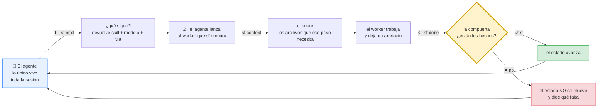
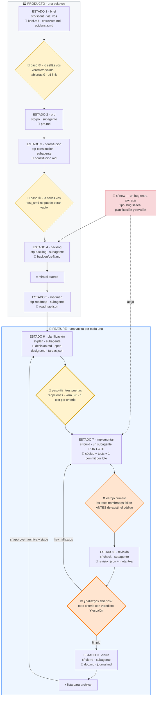
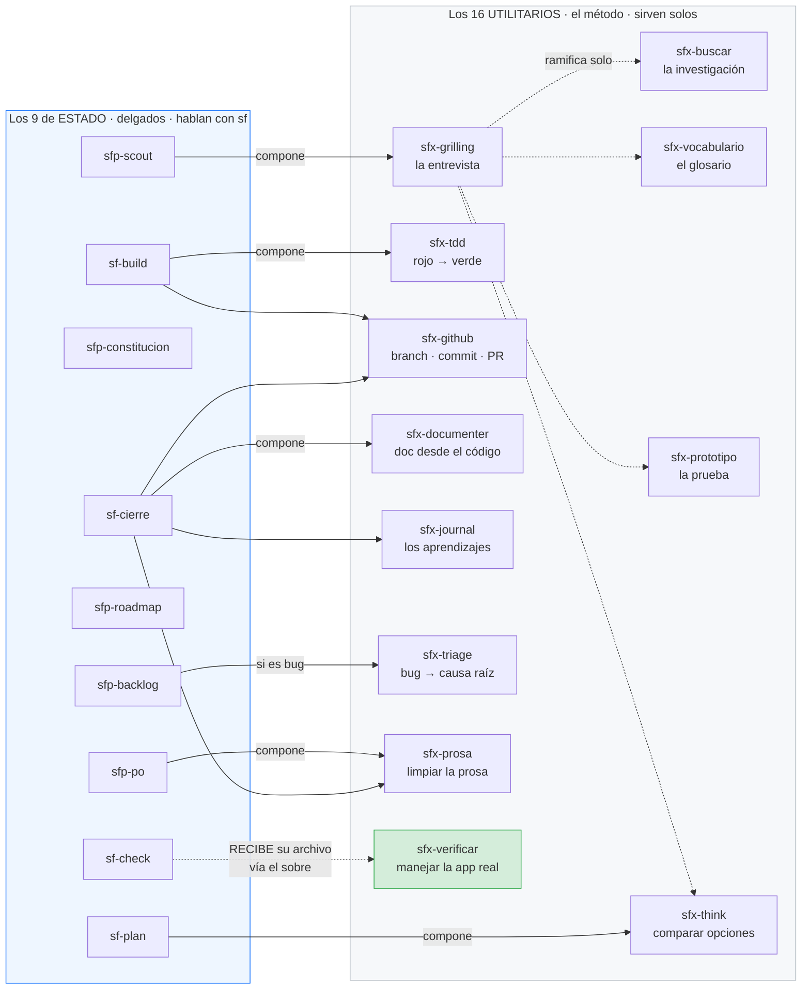
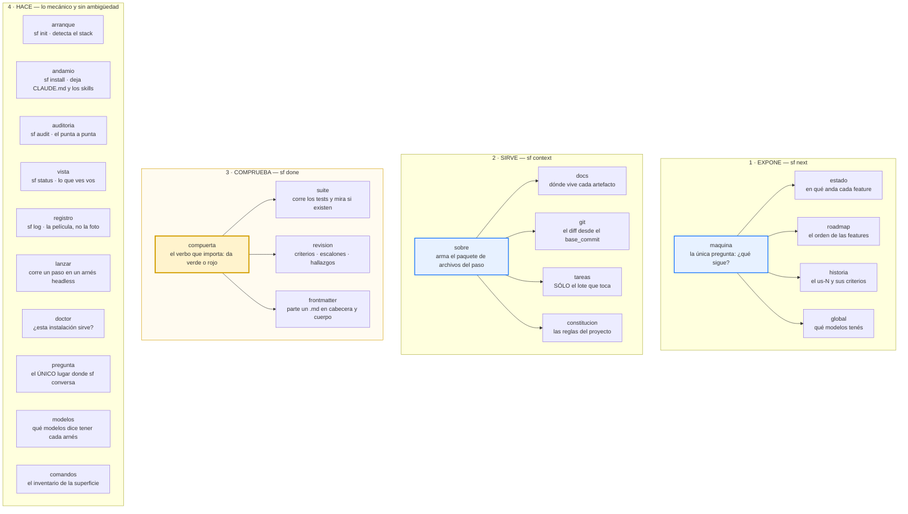
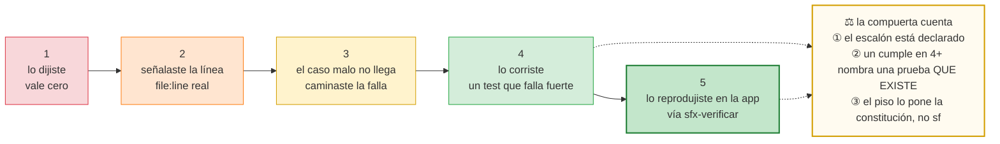

# El mapa completo

**Todo el sistema en una página:** los nueve estados, los veinticinco skills, los veinticuatro
paquetes de Go, y qué archivo aparece en cada paso.

> **Cómo leerlo.** El flujo se lee de arriba abajo. En cada paso hay siempre las mismas cuatro
> cosas: **quién trabaja** (un skill), **cómo se lanza** (`via:`), **qué deja** (un artefacto),
> y **qué comprueba `sf` antes de dejar avanzar** (la compuerta).

---

## 1. El bucle de tres tiempos

Antes del flujo, el mecanismo. **Todo SpecForge es este bucle repetido veintitrés veces.**



**Las tres reglas que este dibujo encodea:**

1. **`sf` nunca lanza a nadie.** Arranca, contesta y muere: dura milisegundos. Un programa muerto
   no tiene manos. El que lanza es el agente.
2. **El estado avanza sobre hechos comprobados**, nunca sobre la palabra del que trabajó. El
   worker dice *"listo"*; `sf` **no le cree**: corre los tests él mismo, mira si el archivo está.
3. **El estado vive en el repo** (`.docs/estado.json`), no en el chat. Cuando cambiás de modelo,
   el que implementa no estuvo en la conversación.

---

## 2. El flujo entero

Cinco estados corren **una vez por producto**. Cuatro corren **una vez por cada feature**.

> **Ojo con los dos números, porque conviven.** Los **estados** son nueve y se cuentan 1–9. Los
> **pasos** son veintitrés y se escriben con círculo (⑥, ⑧, ⑰): son el detalle fino adentro de
> los estados, y las tres paradas 🛑 se nombran por paso. El ⑥ que sella el brief **no** es el
> estado 6.



> **El ⑥ es la única parada donde `sf` no pregunta sino que corta.** Un hallazgo abierto manda la
> feature de vuelta a implementar, y la revisión **se rehace entera**: nadie marca nada como
> arreglado, simplemente el hallazgo no reaparece.

---

## 3. Cómo se componen los skills

**Un skill de estado es delgado y compone utilitarios.** El método vive en el `sfx-`; el skill de
estado sólo sabe hablar con la máquina.



**La flecha punteada de `sf-check` dice algo distinto a las demás, y la diferencia importa.**
`sf-check` **no invoca** a `sfx-verificar`: recibe **el archivo** que ese utilitario dejó en
`.docs/verificar/`, servido por el sobre. `sfx-verificar` se corre **una vez por proyecto**, a
mano, y el ⑧ de cada feature cosecha lo que dejó.

> **Por qué los `sfx-` no se tocan.** Un utilitario que aprendiera a llamar a `sf done` dejaría de
> servir fuera de un proyecto SpecForge — que es la mitad de su valor.

---

## 4. Qué código de Go interviene en cada fase

`sf` tiene **cuatro verbos**, y cada uno enciende un juego distinto de paquetes.



**Lo que `sf` escribe y lo que NO, que es la división que importa.** Ninguno de estos paquetes
escribe un artefacto del flujo: `brief.md`, `spec-design.md`, el código y los tests los escribe
**el que trabaja**, nunca el binario. `sf` sólo escribe su propia contabilidad:

```
estado     .docs/estado.json      dónde estás            ← el archivo del que depende todo
registro   .specforge/*.jsonl     la película de la sesión
revision   revision.json          sólo en `sf dismiss`, cuando descartás un hallazgo
arranque   el esqueleto           una vez, en `sf init`
andamio    CLAUDE.md · los skills una vez, en `sf install`
global     ~/.specforge/          el catálogo de modelos, fuera del repo
maquina    el esqueleto del us-#  en `sf new` · y mueve la carpeta en `sf approve`
lanzar     la salida de la corrida  sólo en modo headless
```

**Esa lista corta es la regla dura número 2 puesta en código.** Si `sf` escribiera artefactos,
estaría haciendo el trabajo que juzga — y una compuerta que redacta lo que después aprueba no es
una compuerta.

---

## 5. Dónde queda cada cosa

Todo vive en `.docs/`, **versionado con el repo**, porque el que implementa mañana no estuvo en
la conversación de hoy.

```mermaid
flowchart TD
    ROOT[".docs/"]

    ROOT --> EST["estado.json<br/>⬅ el ÚNICO que sf escribe"]
    ROOT --> PROD["producto · una vez"]
    ROOT --> FEAT["features/ · la que está viva"]
    ROOT --> ARCH["archivado/ · las cerradas, enteras"]
    ROOT --> VER["verificar/ · cómo manejar la app"]

    PROD --> A1["brief.md · entrevista.md · evidencia.md"]
    PROD --> A2["prd.md"]
    PROD --> A3["constitucion.md<br/>test_cmd · mutacion · git · verificacion"]
    PROD --> A4["backlog/us-N.md<br/>las historias y sus criterios"]
    PROD --> A5["roadmap.json<br/>sólo ids y orden"]

    FEAT --> B1["decision.md<br/>vara + 3 opciones + puntaje"]
    FEAT --> B2["spec-design.md<br/>lo único que lee el implementador"]
    FEAT --> B3["tareas.json<br/>tareas · lotes · tests · modelo"]
    FEAT --> B4["revision.json<br/>veredicto + escalón por criterio"]
    FEAT --> B5["mutantes/<br/>los del modelo, para re-correrlos"]
    FEAT --> B6["doc.md · journal.md"]

    VER --> C1["SKILL.md<br/>launch · doctor · drive · evidence · cleanup"]
    VER --> C2["features/<br/>el mapa: qué más hay que manejar"]
    VER --> C3["pruebas/<br/>la evidencia del escalón 5"]

    style EST fill:#f8d7da,stroke:#dc3545,stroke-width:2px
    style ARCH fill:#e2e3e5,stroke:#6c757d
    style VER fill:#d4edda,stroke:#28a745
```



> **`archivado/` no es un cajón de cosas viejas.** Una spec archivada es **el registro de una
> decisión, con fecha**. Cuando entra un bug sobre algo ya cerrado, el sobre le sirve al
> implementador la spec de la feature que rompió — sin eso, improvisa.

---

## 6. La escalera de evidencia

El ⑧ no contesta *"¿cumple?"* sino *"¿cumple, y cómo lo sabés?"*. Eso es lo que separa tres cosas
que antes eran el mismo byte.



**La ② es la que atrapa la mentira barata**, y no es una opinión: decir *"escalón 4"* cuesta dos
bytes, que el test exista no. Es el mismo truco que usa `sf audit` cuando pregunta si los tests
que probaban un criterio **siguen existiendo**.

---

## 7. Los veinticinco skills, en una línea cada uno

### Los nueve de estado — corren donde `sf next` los nombra

| Skill | Estado | Qué hace |
|---|---|---|
| `sfp-scout` | ① brief | Pinponea la idea, busca si ya existe, la estresa, y devuelve un veredicto |
| `sfp-po` | ② prd | Convierte el brief en actores, capacidades, restricciones y alcance |
| `sfp-constitucion` | ③ constitución | Escribe arquitectura, stack, convenciones, y llena la cabecera que `sf` lee |
| `sfp-backlog` | ④ backlog | Corta el PRD en historias con criterios que tienen id |
| `sfp-roadmap` | ⑤ roadmap | Agrupa las historias en features y las ordena. Sólo ids y orden |
| `sf-plan` | ⑥ planificación | Vara, tres opciones, spec, tareas, tests y modelo — en una sola pasada |
| `sf-build` | ⑦ implementar | Un lote: los tests primero, el rojo, después el código, y un commit |
| `sf-check` | ⑧ revisión | Un veredicto con escalón por **cada** criterio, más los mutantes |
| `sf-cierre` | ⑨ cierre | La doc en dos mitades, el journal, y el mapa de features si hay |

### Los dieciséis utilitarios — sirven solos, en cualquier proyecto

| Skill | Qué hace |
|---|---|
| `sfx-grilling` | **El primitivo de entrevista**: árbol, frontera, rondas. Dueño único del método |
| `sfx-buscar` | **El primitivo de investigación**: nivel 0 sin llave antes que los MCPs, con procedencia |
| `sfx-vocabulario` | **El primitivo del glosario**: perezoso, sólo cuando una palabra se tambalea |
| `sfx-prototipo` | **El primitivo de la prueba**: código descartable que contesta UNA pregunta |
| `sfx-verificar` | **El primitivo de la verificación**: genera el skill que maneja la app de verdad |
| `sfx-prosa` | **El primitivo de la prosa**: reglas `P-#` numeradas, derivadas del castellano de acá |
| `sfx-think` | Compara opciones que ya están sobre la mesa y llega a una conclusión escrita |
| `sfx-grill-me` | La entrevista suelta, sin producto atrás. Compone `sfx-grilling` |
| `sfx-tdd` | Rojo → verde → refactor, una rebanada por vez |
| `sfx-github` | Branch, commit, push, PR, merge. Dueño del remoto |
| `sfx-interrogar` | Varios modelos sobre el mismo diff: lo que dos encuentran solos es la señal alta |
| `sfx-documenter` | Documentación exhaustiva sacada del código |
| `sfx-journal` | Captura aprendizajes anclados en evidencia |
| `sfx-triage` | Investiga un bug hasta la causa raíz |
| `sfx-explain` | Explica un concepto con el método Feynman |
| `sfx-audit` | El auditor punta a punta: varias features, y si el implementador mintió |

> **El prefijo no es decorativo.** Si `sf next` devolviera el nombre de un `sfx-`, el orquestador
> lanzaría a alguien que **nunca va a llamar a `sf done`**, y el estado no se movería nunca.

---

## 8. Los veinticuatro paquetes de Go, en una línea cada uno

| Paquete | Qué hace | Cuándo corre |
|---|---|---|
| `maquina` | Contesta la única pregunta que importa: **¿qué sigue?** | `sf next` |
| `compuerta` | **El verbo que importa**: da verde o rojo, y en rojo no se pasa | `sf done` |
| `sobre` | Arma lo que `sf context` le sirve al que va a trabajar | `sf context` |
| `estado` | Lee y escribe `estado.json` — **el único archivo que `sf` escribe** | siempre |
| `docs` | Las rutas de los artefactos, y nada más | siempre |
| `roadmap` | Lee `roadmap.json`: el orden en que se hacen las features | next · sobre |
| `historia` | Lee un `us-#.md`: el requisito y sus criterios | next · compuerta |
| `tareas` | Lee `tareas.json`: las tareas de una feature y sus lotes | sobre · compuerta |
| `revision` | Lee `revision.json`: criterios con escalón, mutantes y hallazgos | compuerta · audit |
| `constitucion` | Lee la cabecera de `constitucion.md`: `test_cmd`, `mutacion`, `git` | sobre · compuerta |
| `suite` | Corre los tests del proyecto y mira si existen | compuerta |
| `frontmatter` | Parte un `.md` en cabecera y cuerpo | compuerta |
| `git` | Shell-out a git, y nada más | sobre · audit |
| `auditoria` | El punta a punta, y el único que mira **varias** features | `sf audit` |
| `vista` | Genera lo que `sf status` te muestra | `sf status` |
| `registro` | **La película**; el `estado.json` es la foto | `sf log` |
| `arranque` | Detecta el stack y deja el esqueleto | `sf init` |
| `andamio` | Deja `CLAUDE.md`, `AGENTS.md` y los skills en su lugar | `sf install` |
| `doctor` | Contesta una sola pregunta: **¿esta instalación sirve?** | `sf doctor` |
| `global` | El catálogo de modelos: qué tenés y cómo se llaman | next · sobre |
| `modelos` | Lista los modelos que cada arnés dice tener | `sf models` |
| `lanzar` | Corre un paso de la máquina en un arnés headless | `sf lanzar` |
| `pregunta` | **El único lugar donde `sf` conversa** | `sf install` |
| `comandos` | El inventario de la superficie: qué comandos hay | `sf -h` |

---

## 9. Las tres reglas duras, otra vez

Todo el mapa de arriba se sostiene sobre estas tres, y ninguna es negociable:

```
1.  sf NUNCA lanza a nadie          si lanzara, sería un arnés — y ya hay dos buenos
2.  el estado avanza con HECHOS     el subagente dice "listo"; sf lo comprueba él mismo
3.  el estado vive en el REPO       el que implementa no estuvo en la conversación
```

**Y el corolario que explica por qué `CLAUDE.md` tiene cuatro líneas:** `sf next` devuelve el
skill, el modelo y el `via:` juntos. Si no los devolviera, la tabla `estado → skill → modelo`
viviría en el orquestador y habría que mantener **una copia por arnés**.

---

**Para ir más hondo:** [los estados uno por uno](estados.md) · [los artefactos](artefactos.md) ·
[los comandos](comandos.md) · [los skills](skills.md) · [primeros pasos](primeros-pasos.md)
