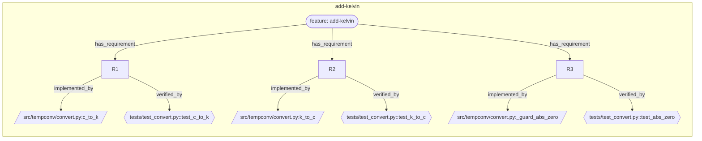

# SpecForge examples

Worked, end-to-end features so you can see what the pipeline actually
produces — not just how it's described. Every artifact is **JSON-first**: a
validated `.json` **source** plus the `.md` **render** `sf` generates from it.

Each example is a self-contained project. With `sf` on your PATH you can run the
validators from inside any of them.

| Example | Lane | Scenario | Shows |
|---------|------|----------|-------|
| [`slugify/`](slugify/) | standard | Greenfield — a slug helper, built from zero and **archived** | The full pipeline: requirements → design → tasks → plan → review, with the gate ledger |
| [`brownfield-tempconv/`](brownfield-tempconv/) | standard | Brownfield — adding `add-kelvin` to a library that already had `c_to_f` | Specs layered onto existing code; the trace spine over a real change |
| [`lite-wordcount/`](lite-wordcount/) | **lite** | A one-file bugfix (`word_count("")` returned 1) | The lite lane: one `change.md`, fewer gates, still a test + `trace.json` |

## What to look at

**The JSON-first pair.** Open any artifact's `.json` next to its `.md` — e.g.
`brownfield-tempconv/specforge/features/add-kelvin/requirements.json` and
`requirements.md`. The JSON is the source of truth; the Markdown is generated, so
it can't drift.

**The gate ledger.** `*/specforge/features/<name>/feature.json` records every gate
that passed, with timestamps — the source of truth for status. State lives **per
feature**, not in one monolithic file, so two features never contend for the same
bytes. Compare the **standard** ledger (lane → requirements → design → tasks →
plan → wave-N → verdict) with the **lite** one (lane → change → wave-0 → verdict).

**Acceptance criteria carry ids.** In `requirements.json`, each criterion is an
object with its own `id` (`R4.1`, `R4.2`), not a loose string. That id is what
lets a test anchor to *that case*: without it the verdict can only ask "does R4
have a test?", and a requirement with two criteria seals green on one. `slugify`'s
`R4` is exactly that shape — two criteria, two tests.

**The trace spine.** `trace.json` maps each requirement to its `path:symbol`, and
each *criterion* to the test that verifies it (`requirements.R4.scenarios.R4.1`).
It's what drift detection and the verification contract read.

**Domain knowledge.** `brownfield-tempconv/specforge/context/domain.json` holds
project-level domain knowledge (glossary + entities + business rules). Rules carry
`applies_to`, so `sf context for-judge` injects only the ones relevant to the phase
being checked — the same mechanism the constitution principles use.

## The knowledge graph

`sf graph export` makes the trace spine **visible**. It walks the declared
structure only (no LLM, no embeddings) and emits `graph.json` + `graph.mmd`. Below
is the actual graph of `brownfield-tempconv`, generated by:

```sh
cd examples/brownfield-tempconv && sf graph export --format=mermaid --stdout
```

Each feature is a box; `R#` requirements point to the `code:symbol` that
implements them and the test that verifies them — the spine `feature → R → code →
test`, straight from `feature.json` + `trace.json`:



## Verify them yourself

```sh
# (from inside an example dir, with `sf` on PATH)

# per-feature status, phase, drift, blockers, critical path
sf status

# the requirement → code → test matrix vs the actual repo
sf trace verify --feature=add-kelvin      # in brownfield-tempconv/

# archived specs whose code anchor vanished (reads trace.json)
sf doctor --drift                         # in slugify/

# run the spec's acceptance tests
PYTHONPATH=src python3 -m pytest -q        # brownfield-tempconv/ and lite-wordcount/
PYTHONPATH=src python3 -m doctest src/texttools/slug.py -v   # slugify/
```

A completed feature lives under `specforge/archive/<date>-<name>/`; a feature
still in flight lives under `specforge/features/<name>/` with the same file set.
